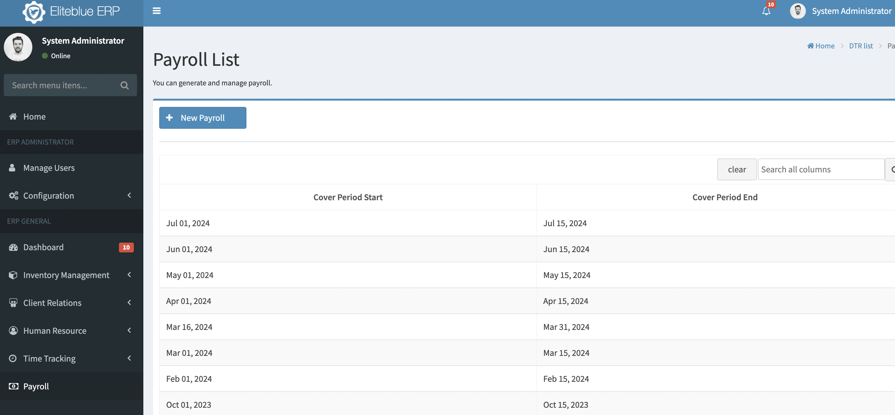
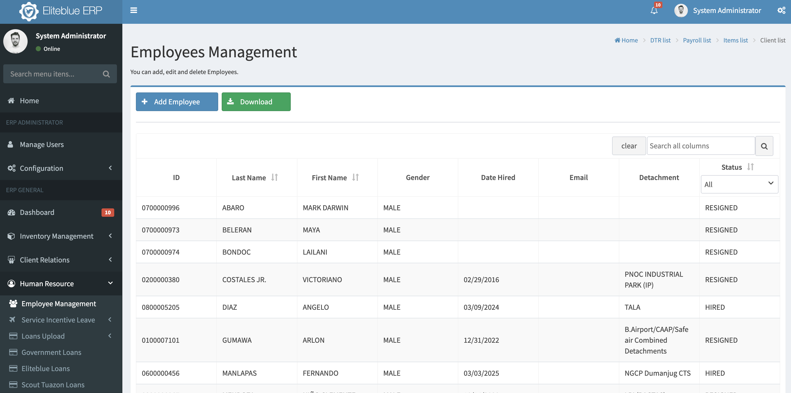
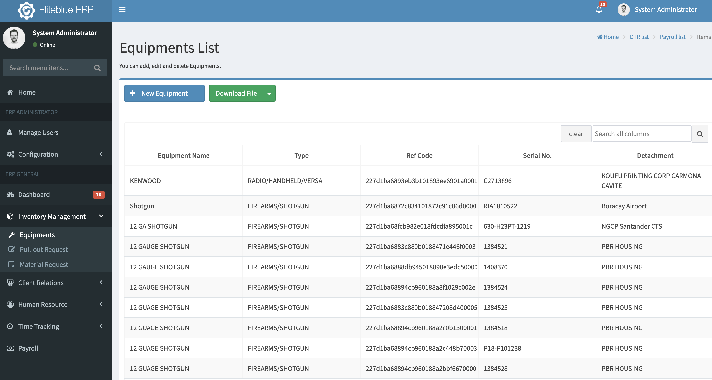

# EliteBlue ERP

EliteBlue ERP is a web-based Enterprise Resource Planning (ERP) system built using the Springboot framework, specifically designed for security agencies. It manages the entire employee lifecycle, from recruitment to payroll, and also handles inventory management for branch equipment.





## Features

*   **Employee Management:**  A complete system for managing security personnel, covering:
    *   **Recruitment:**  Tracking applicants, managing the hiring process.
    *   **Onboarding:**  Handling new employee setup and documentation.
    *   **Employee Records:**  Storing and managing detailed employee information.
    *   **Payroll:**  Calculating and processing employee salaries and deductions.
    *   **Offboarding/Termination:** Managing employee departures.

*   **Inventory Management (Branch-Specific):**
    *   Tracking of equipment assigned to each branch.
    *   Equipment allocation and deallocation.
    *   Inventory levels and reporting.

*   **Authentication and Authorization:** User accounts with different roles and permissions.

*   **Dashboard:** Visual representations of key data for quick insights.

## Technology Stack

*   **Backend:** Java
*   **Framework:** JavaServer Faces (JSF), Springboot
*   **UI Library:** AdminFaces (Bootstrap-based admin theme)
*   **Database:** PostgreSQL
*   **Build Tool:** Maven (evident from `pom.xml`)
*   **Application Server:** Tomcat
*   **ORM:** Hibernate, JPA

## Installation

These instructions assume you have the following prerequisites installed:

*   Java Development Kit (JDK): [**SPECIFY JDK VERSION** - e.g., JDK 11, JDK 17] (Check your `pom.xml` for the required Java version.)
*   Maven
*   PostgreSQL (and it's running)
*   Your chosen Application Server (e.g., Tomcat, GlassFish, etc.) - already installed and configured.

1.  **Clone the repository:**

    ```bash
    git clone https://github.com/aastillero/eliteblue_erp.git
    cd eliteblue_erp
    ```

2.  **Database Setup:**
    *   Ensure your PostgreSQL database is running.
    *   Edit application.properties for database details
    * The application expects a PostgreSQL database.

3.  **Build the project:**

    ```bash
    mvn clean install
    ```
    This will compile the code, run tests (if any), and create a WAR (Web Application Archive) file, likely in the `target` directory.

4.  **Deploy to the Application Server:**

    *   [**FILL IN DEPLOYMENT INSTRUCTIONS SPECIFIC TO YOUR APPLICATION SERVER**] - This is *crucial*.  Examples:
        *   **WildFly/JBoss:**  Copy the WAR file to the `standalone/deployments` directory.
        *   **GlassFish/Payara:**  Use the admin console or the `asadmin` command-line tool to deploy the WAR.
        *   **Tomcat:** Copy the WAR file to the `webapps` directory.  (Note: Tomcat is a servlet container, not a full Java EE application server.  You'll need to ensure your JSF implementation and other dependencies are correctly configured for Tomcat.)

5.  **Access the application:**

    *   Once deployed, the application should be accessible through a URL like:  `http://localhost:[port]/[context-root]`
    *   Default context root is erp - The port depends on your application server configuration.  The context root is usually the name of the WAR file (without the `.war` extension), but it can be customized.

## Configuration

*   **`pom.xml`:**  Maven project configuration.  This file manages dependencies, build settings, and plugins.
*   **`src/main/resources/META-INF/persistence.xml` (or similar):**  JPA persistence unit configuration (if you are using JPA).  This is where the database connection is usually defined.
*   **`src/main/webapp/WEB-INF/web.xml`:**  Web application deployment descriptor.  This file contains configuration for servlets, filters, listeners, and other web application settings.
*   **`src/main/webapp/WEB-INF/faces-config.xml`:** JSF configuration file.  Defines managed beans, navigation rules, and other JSF-specific settings.
*   **`src/main/resources/application.properties`:** Sprinboot properties configuration and Hibernate.

## Deployment (Production)

Deploying to a production environment requires careful planning and configuration:

1.  **Choose a hosting provider:** Consider providers like AWS, Google Cloud, or dedicated server hosting.
2.  **Set up a production PostgreSQL database:** Use a managed database service or set up PostgreSQL on a dedicated server.  Ensure proper backups and security.
3.  **Configure your Application Server:**
    *   Set up the application server for production use (security hardening, performance tuning).
    *   Configure data sources for your database connection.
    *   Ensure the correct Java version is used.
4.  **Secure the application:**
    *   Use HTTPS (SSL/TLS certificates).
    *   Implement proper authentication and authorization.
    *   Protect against common web vulnerabilities (e.g., SQL injection, cross-site scripting).
5.  **Monitoring:** Set up monitoring and logging to track the application's performance and identify issues.
6.  **Backups:** Implement regular backups of your database and application files.

## Contributing

Contributions to EliteBlue ERP are welcome! To contribute:

1.  **Fork the repository:** Create a fork of the repository on your own GitHub account.
2.  **Create a branch:** Create a new branch for your feature or bug fix.  Use a descriptive name (e.g., `feature/add-payroll-report` or `bugfix/inventory-calculation`).
3.  **Make your changes:** Implement your feature or fix the bug.
4.  **Write tests:** If applicable, write *unit tests* and/or *integration tests* to ensure your code works correctly and doesn't introduce regressions.  [**CONFIRM IF YOU HAVE TESTS AND HOW TO RUN THEM** - e.g., `mvn test`]
5.  **Commit your changes:** Use clear and concise commit messages.
6.  **Push your branch:** Push your branch to your forked repository.
7.  **Create a pull request:** Submit a pull request from your branch to the `main` branch of the original repository.
8.  **Code Review:** Your pull request will be reviewed, and you may be asked to make changes.

Please follow the existing code style and conventions.

## License

This project is released under the **MIT License**. See the [LICENSE](LICENSE) file for details.  The MIT License is a permissive open-source license that allows for free use, modification, and distribution, even for commercial purposes.

## Contact

Contact information is available on the GitHub repository.